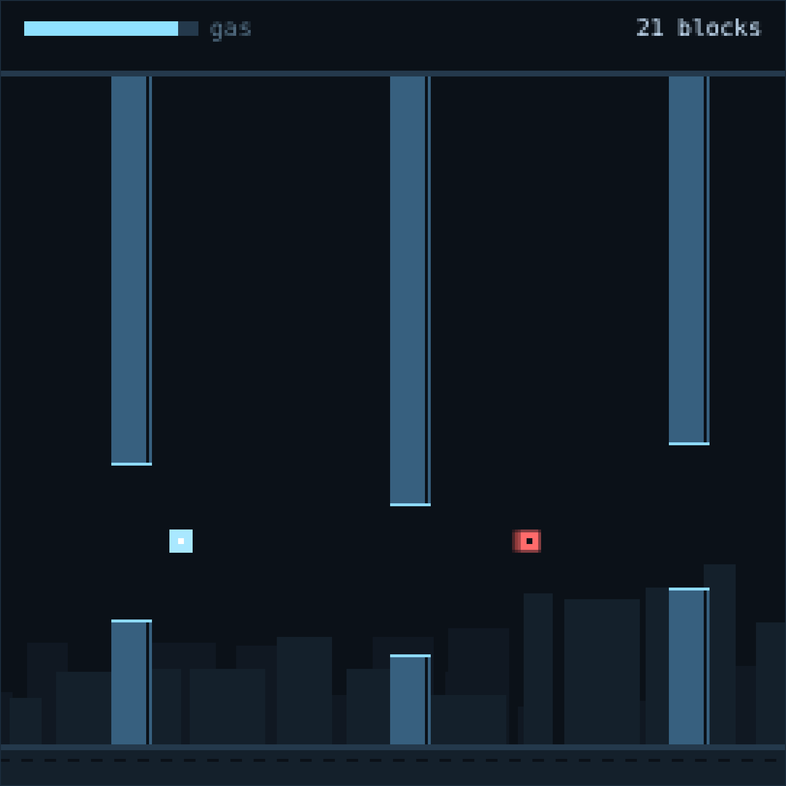

# mempool

A small browser game about getting a transaction included, plus the devlog
tooling that posts about it.



No dependencies, no build step, no wallet. Two files matter: the engine, and the
generator that turns work on the engine into drafts for X.

```
npm start       # http://localhost:8080
npm test        # 15 tests, no framework
npm run sim     # headless balance run, writes data/sim-latest.json
npm run devlog  # a draft post about what changed, with its receipts
```

## The game

You are a transaction. Blocks scroll at you with a gap in each one, and the gap
shrinks as you go. Arrows or `W`/`S` move, `space` burns gas for a harder, faster
move. On a phone: drag to steer, hold near the left edge to boost.

The red squares are sandwich bots. **They do not kill you.** They cost you 35
gas, reset your combo and make the controls mushy for a third of a second — and
then you fly into a wall entirely by yourself. Passing close to the centre of a
gap is a tight line: it pays gas back and builds a combo.

`?seed=12345` replays an exact run. `?record=1` strips the page down to a clean
square frame for a screen capture.

## The measurement, not the vibe

The page and the headless simulator import the same engine, so a number
measured in the sim is the number a player gets. The scripted bot in
`src/engine/bot.js` plays thousands of runs and the result lands in
`data/sim-latest.json`.

Latest run, 2000 runs at 6px of aim jitter:

| | |
|---|---:|
| median | 57 blocks |
| p10 / p90 | 40 / 71 blocks |
| longest run | 59.03 s |
| tight lines | 89% of gaps |
| sandwiches per run | 9.68 |
| deaths inside 1.5 s of a sandwich | 61.2% |
| deaths caused by a wall | 100% |

Every death is a wall. Most of them are a chaser's fault. That is the whole
design in one line, and it is a measured claim rather than a feeling.

## The devlog generator

`tools/devlog.js` writes drafts about the game from three sources only:

- `git` — commits, files changed, lines in and out since the last saved draft
- `tools/test.js` — how many tests ran and passed
- `data/sim-latest.json` — the balance numbers above

```
node tools/devlog.js                       # format picked from the weekday plan
node tools/devlog.js --kind=balance        # sim numbers
node tools/devlog.js --kind=build          # what changed since the last draft
node tools/devlog.js --kind=broke          # the latest fix commit
node tools/devlog.js --kind=ship           # the launch post
node tools/devlog.js --kind=note --note="…" # your own observation, unedited
node tools/devlog.js --kind=balance --thread --save
```

Two rules are enforced in code rather than remembered:

1. **No invented numbers.** Every number in a draft is checked against the
   collected facts before it is printed. A template that produces a number with
   no source fails generation. A test asserts this for every format.
2. **No invented experience.** The `note` format refuses to run without a real
   observation passed in. It will not write one for you.

`tools/voice.js` holds the formatting rules — all lowercase except product
names, no final full stop, no emoji, no thread markers, no tickers, no hype
phrases, no essay connectives, no link in the opener. Every generated draft is
linted, and the tests check the linter against known-good and known-bad text.

Saved drafts land in `posts/YYYY-MM-DD-kind.md` with the full fact set attached
underneath, so any claim in a post can be checked against the run that produced
it.

## Posting

`tools/x-post.js` is optional and dry-run by default. It lints first and refuses
to send anything with a lint error.

```
export X_API_KEY=… X_API_SECRET=… X_ACCESS_TOKEN=… X_ACCESS_SECRET=…
node tools/x-post.js posts/2026-09-12-build.md        # prints, posts nothing
node tools/x-post.js posts/2026-09-12-build.md --yes  # opener, then replies
```

Media is deliberately not supported. Clips get looked at frame by frame for
personal data before they go anywhere.

## Capturing a clip

The canvas is 270×270 logical pixels and scales by whole numbers only, so a 4×
capture is exactly 1080×1080 — the square crop that stays readable on a phone.
Open `?record=1`, let the attract-mode bot play, record 10–20 seconds, cut
straight to the part where something goes wrong.

## Layout

```
index.html            the page
src/engine/config.js  every tunable number
src/engine/game.js    the simulation — no dom, no timers, no Math.random
src/engine/bot.js     scripted policy, shared by the sim and attract mode
src/web/              renderer, input, main loop
tools/sim.js          headless balance run
tools/test.js         the suite
tools/voice.js        the account's formatting rules as code
tools/devlog.js       draft generator
tools/x-post.js       optional publisher, dry run by default
```
